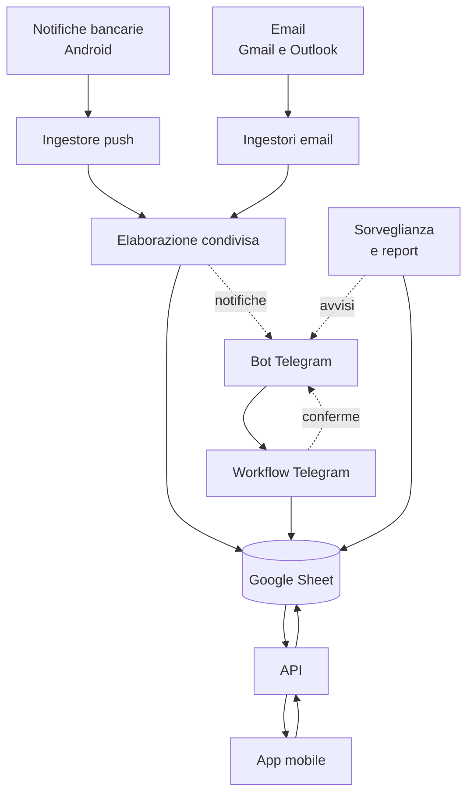

# Leroy

Sistema di gestione delle finanze personali che raccoglie le spese in modo
automatico da più fonti, le categorizza e le rende consultabili da un'app
mobile.

Nasce per sostituire un'app di tracking manuale non automatizzabile,
mantenendo lo storico accumulato. Gira interamente su servizi con piano
gratuito: il costo di esercizio è zero.

---

## Cosa fa

Una spesa entra nel sistema senza che tu faccia nulla. La notifica della
banca, la mail di conferma di PayPal, la bolletta in PDF: ognuna di queste
diventa una riga registrata, categorizzata e consultabile.

Quello che non arriva da solo — i contanti, una spesa divisa fra amici — lo
inserisci in due secondi da un bot Telegram o dall'app.

- **Raccolta automatica** da email, notifiche Android e messaggi
- **Categorizzazione** basata su regole apprese, con un modello linguistico
  come riserva
- **Deduplica** fra fonti: la stessa spesa vista da due canali diventa una
  riga sola
- **Riconciliazione degli addebiti annunciati**: una bolletta comunicata oggi e
  addebitata fra due settimane resta una spesa sola, contata quando i soldi
  escono davvero
- **Riconoscimento delle ricorrenze**: gli abbonamenti si deducono dallo
  storico, e il sistema avvisa quando uno salta o rincara
- **Sorveglianza di sé stesso**: gli errori e le fonti che smettono di
  produrre dati vengono segnalati invece di passare inosservati
- **Report settimanali e mensili** con confronti sullo storico
- **Interfaccia mobile** installabile: riepiloghi, andamento a dodici mesi,
  budget per categoria, ricerca su tutto lo storico, inserimento e correzione
- **Storico preservato**: i dati precedenti sono stati migrati e convivono con
  quelli nuovi

---

## Architettura



Il sistema ha cinque strati.

**Le fonti** sono i canali da cui arrivano i movimenti. Ognuna ha un proprio
ingestore, il cui unico compito è tradurre un formato specifico — una mail,
una notifica, un messaggio — in una struttura comune.

**L'elaborazione** è condivisa: un solo componente riceve i dati normalizzati
da qualsiasi ingestore, ne estrae importo, esercente e categoria, verifica che
non sia un duplicato e scrive. Aggiungere una fonte nuova significa scrivere un
ingestore, non toccare la logica.

**Lo storage** è un Google Sheet. È una scelta deliberata: i dati restano
leggibili e modificabili anche senza il sistema, si aprono dal telefono, si
esportano in un clic. Nessun lock-in.

**Le interfacce** sono due. Il bot Telegram per l'inserimento rapido, le
conferme e le domande; una PWA per la consultazione. La PWA non conosce lo
storage: parla con un'API che espone il foglio, quindi cambiare il database
sottostante non la toccherebbe.

**La sorveglianza** è l'ultimo strato, ed è quello che rende il sistema
affidabile: controlla che le fonti continuino a produrre, che gli addebiti
previsti si presentino, che le ricorrenze non saltino, e riporta gli errori
invece di lasciarli morire in un log che nessuno legge.

### Il percorso di un movimento

1. Un canale produce un evento grezzo — testo di una notifica, corpo di una
   mail, messaggio scritto a mano
2. L'ingestore corrispondente lo normalizza in una struttura comune
3. L'elaborazione tenta prima le regole deterministiche, che sono gratuite e
   istantanee; solo se falliscono interviene il modello linguistico
4. Il risultato viene verificato: importo plausibile, categoria esistente,
   momento coerente
5. Si distingue un addebito già avvenuto da un addebito soltanto annunciato
6. Si controlla che non sia lo stesso movimento già arrivato da un altro
   canale, o che non chiuda un addebito annunciato in precedenza
7. La riga viene scritta e ne arriva notifica su Telegram
8. Se la fiducia nella categoria è bassa, la notifica chiede conferma — e la
   risposta genera una regola che rende superflua l'AI la volta successiva

Quest'ultimo punto è il meccanismo su cui si regge l'economia del sistema: più
lo usi, meno chiamate esterne servono.

### Annunci e addebiti

Una bolletta comunicata via email il 10 e addebitata sul conto il 27 sono lo
stesso movimento, visto due volte a diciassette giorni di distanza. Nessuna
finestra di deduplica ragionevole può collegarli, e allargarla abbastanza
significherebbe collassare spese diverse ma di pari importo.

Il sistema tratta quindi l'annuncio per quello che è: **una previsione**. Viene
registrato in uno stato che non concorre ai totali ma resta visibile, e quando
l'addebito arriva davvero la previsione viene chiusa e diventa la transazione,
datata al giorno in cui i soldi sono usciti.

Se l'addebito non si presenta entro qualche giorno dalla data prevista — banca
con notifiche mute, telefono spento — il sistema lo chiede.

### Principi seguiti

**Niente sparisce in silenzio.** Ogni scarto viene registrato con il motivo.
Un duplicato visibile è un fastidio; una spesa scomparsa è un buco che non
scopri mai.

**Il deterministico prima del probabilistico.** Gli importi non vengono mai
interpretati da un modello quando è possibile estrarli con una regola. L'AI
lavora sulla coda lunga, non sui casi noti.

**Il modello propone, il codice verifica.** Ogni risposta del modello viene
confrontata con qualcosa di oggettivo: la categoria contro l'elenco reale,
l'importo contro le cifre trovate nel testo, un annuncio contro l'esistenza di
una data futura. Quando la verifica fallisce, il dato entra comunque ma marcato
da controllare.

**Nelle domande in italiano, il modello traduce ma non calcola.** Trasforma la
richiesta in un filtro; l'aritmetica la fa lo stesso codice che serve la
ricerca dell'app.

**Ogni valore incerto è marcato tale.** Le righe con confidenza bassa nascono
in stato *da verificare* e restano visibili finché non le confermi.

---

## Struttura della repo

```
leroy/
├── README.md              questo file
├── LICENSE
├── .gitignore
├── app/                   la PWA (file statici, nessun build)
│   ├── index.html
│   ├── app.js
│   ├── style.css
│   ├── manifest.json
│   ├── sw.js
│   └── icon-*.png
├── infra/                 quello che gira sul server
│   ├── docker-compose.yml
│   ├── Caddyfile
│   ├── .env.example
│   └── backup.sh
├── n8n/                   workflow esportati + loro documentazione
│   ├── README.md
│   └── *.json
├── docs/
│   ├── installazione.md   dal server vuoto al sistema in funzione
│   ├── api.md             contratto dell'API usata dalla PWA
│   └── schema-dati.md     fogli, colonne e semantica
└── scripts/
    └── migra_1money.py    migrazione dello storico
```

---

## Componenti e requisiti

| Componente | Ruolo | Costo |
|---|---|---|
| VM ARM (Oracle Always Free) | orchestratore e web server | 0 |
| n8n Community self-hosted | automazione | 0 |
| Caddy | reverse proxy e TLS automatico | 0 |
| PostgreSQL | database di n8n | 0 |
| Google Sheets | storage dei dati | 0 |
| Google Gemini API | categorizzazione e ricerca, piano gratuito | 0 |
| Bot Telegram | inserimento, notifiche, domande | 0 |
| MacroDroid (Android) | cattura delle notifiche bancarie | 0 |
| Dominio dinamico + Let's Encrypt | HTTPS | 0 |

Serve un dominio che risolva sull'IP del server: va bene un servizio DNS
dinamico gratuito o un dominio proprio.

---

## Installazione

I passaggi completi sono in [`docs/installazione.md`](docs/installazione.md).
In sintesi:

1. Crea la VM e apri le porte 80 e 443 — sia nel firewall del provider sia in
   quello del sistema operativo
2. Punta un nome DNS sull'IP pubblico
3. Copia `infra/`, compila `.env` partendo da `.env.example`, avvia lo stack
4. Crea il Google Sheet e migra lo storico con `scripts/migra_1money.py`
5. Configura le credenziali in n8n e importa i workflow da `n8n/`
6. Copia `app/` nella cartella servita da Caddy

Al primo avvio la PWA chiede indirizzo dell'API e token: restano solo sul
dispositivo.

---

## Sicurezza

**Cosa è esposto su internet:** l'interfaccia di n8n, gli endpoint webhook e i
file statici della PWA. Nient'altro. Il database non ha accesso alla rete,
nemmeno in uscita.

**Cosa protegge cosa:**

- gli endpoint sono autenticati con un token in header, distinto per ciascuno
  così da poterne revocare uno senza spegnere gli altri
- il bot risponde solo a un identificativo utente specifico: chiunque altro lo
  trovi non ottiene nulla
- la PWA non contiene segreti nel codice; il token vive nel `localStorage` del
  dispositivo, viaggia solo verso la stessa origine, e la configurazione
  rifiuta indirizzi non HTTPS o su domini diversi
- una Content Security Policy restrittiva impedisce a qualsiasi codice
  estraneo di comunicare all'esterno

**Cosa resta a carico tuo:** tenere n8n aggiornato, usare una password lunga
con autenticazione a due fattori sul pannello, e non riusare lo stesso token
per endpoint diversi.

L'app ha anche una **modalità privacy** che maschera tutti gli importi con un
tocco: serve a poter mostrare l'interfaccia a qualcuno senza rivelare le cifre.
Non è una misura di sicurezza — i dati restano in memoria — ma copre il caso
per cui è pensata.

---

## Backup

`infra/backup.sh`, da mettere in cron settimanale, produce un archivio con il
dump del database, i workflow in formato leggibile e la configurazione dello
stack. Si segnala su Telegram se fallisce, e si rifiuta di produrre un archivio
se il dump risulta vuoto.

Due avvertenze che valgono più dello script:

**La chiave di cifratura di n8n va conservata fuori dal server.** Senza, un
backup del database è integro ma illeggibile per la parte delle credenziali.

**Un backup che vive sulla stessa macchina protegge da un errore, non da una
perdita.** Portane una copia altrove, e prova il ripristino almeno una volta
prima di averne bisogno.

---

## Limitazioni note

- Le notifiche Android perse mentre il telefono è spento non sono
  recuperabili: a differenza delle email, non restano da nessuna parte. Tenere
  attive più fonti mitiga il problema, e gli addebiti annunciati vengono
  comunque richiesti se non si presentano.
- Alcune banche inviano notifiche prive di contenuto: per quelle il canale
  push non è utilizzabile.
- I PDF privi di livello testo non vengono letti.
- La riconciliazione di un addebito annunciato si basa su importo e data
  prevista: due addebiti di pari importo attesi nello stesso periodo possono
  essere scambiati.
- Il riconoscimento delle ricorrenze produce qualche falso positivo: gli
  esercenti frequentati con regolarità vanno esclusi a mano.
- Il budget per categoria è un valore unico, non storicizzato: modificandolo
  cambia anche il confronto con i mesi passati.
- Non esiste il concetto di giroconto: spostare denaro fra due conti propri
  viene registrato come una spesa e un'entrata.
- La ricerca è testuale e non tollera errori di battitura.
- Sistema pensato per un utente singolo.

---

## Sviluppo

Leroy è stato progettato e scritto in coppia con un assistente AI, in sessioni
di lavoro iterative: architettura, workflow, API e interfaccia sono nati da un
dialogo e non da generazione automatica di codice non letto. Ogni componente è
stato eseguito e verificato prima di essere considerato concluso, e diversi
errori di progettazione sono emersi proprio costruendolo.

### Revisione di sicurezza

Il codice dell'app è stato sottoposto a revisioni mirate sulle classi di
vulnerabilità rilevanti per un'applicazione di questo tipo:

- iniezione nel DOM da dati non fidati — i contenuti arrivano da email,
  notifiche e risposte di un modello linguistico, quindi vanno trattati come
  ostili
- gestione del token: dove è memorizzato, verso dove viaggia, dove non deve
  comparire
- politica di caching del service worker, perché non conservi dati personali
  su disco
- validazione di importi e date prima della scrittura
- assenza di dipendenze esterne e di risorse caricate da terze parti

Le correzioni emerse sono state applicate: obbligo di HTTPS e di stessa origine
per l'endpoint, Content Security Policy restrittiva, eliminazione di ogni
percorso in grado di scrivere HTML non controllato nel DOM.

**Non è un audit professionale.** È un progetto personale, per un utente
singolo, distribuito senza garanzie. Chi volesse riusarlo in un contesto
diverso dovrebbe rivederlo con criteri propri.

---

## Licenza

MIT. Vedi [LICENSE](LICENSE).
